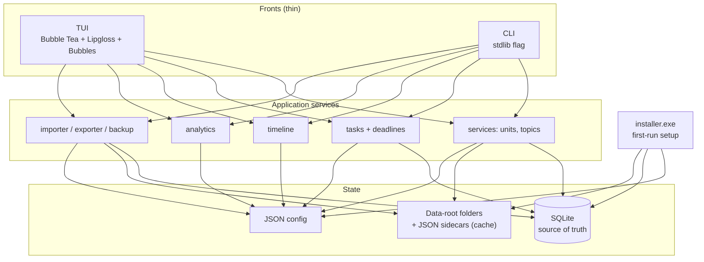

# 02 — System Architecture

## Components and responsibilities

| Component | Location | Owns | Must NOT |
| --------- | -------- | ---- | -------- |
| TUI front | `internal/tui/` | screens, navigation, styling, command input, keyboard handling | SQL, direct file copies, business rules |
| CLI front | `internal/cli/` | arg parsing, help text, exit codes, non-interactive flags | SQL, business rules |
| Services | `internal/services/` + `tasks/`, `timeline/`, `analytics/`, `importer/`, `exporter/`, `backup/` | all use cases; the only callers of DB + filesystem packages | terminal I/O, `os.Exit` |
| Domain | `internal/domain/` | entity structs, status enums, validation, coverage/attention rules | I/O, SQL |
| Database | `internal/database/` | connection, migrations, queries, transactions | path logic, UI strings |
| Filesystem | `internal/filesystem/` | safe paths, create/move/rename/delete, import copies, metadata | SQL |
| Config | `internal/config/` | load/save JSON config, resolve data root | academic logic |
| App bootstrap | `internal/app/` | wires config+DB+services for TUI/CLI/installer | duplicated wiring in `cmd/` |
| Installer | `internal/installer/` + `cmd/installer/` | setup flow, PATH edit, shortcuts | academic logic |
| Logging | `internal/logging/` | `log/slog` setup | — |

Both `cmd/academic/main.go` and `cmd/installer/main.go` are thin: parse minimal
flags, build `app.Context`, delegate.

## Dependency rules

```text
cmd/* ──► app ──► cli / tui ──► services/* ──► domain
                      │              │  ▲
                      │              ▼  │ uses types only
                      │        database filesystem config logging
```

- `tui` and `cli` depend on `services/*` and `domain`, never on `database` or
  `filesystem` directly.
- `services/*` depend on `domain`, `database`, `filesystem`, `config`.
- `domain` depends on nothing internal (stdlib only).
- No cycles. Enforced by code review + `go vet` / import check in Phase 1.

## Shared-service pattern (CLI and TUI use the same code)

```text
TUI screen handler ──┐
                     ├──► services.Units.Create(ctx, db, fs, input)
CLI `units add` ─────┘                    │
                                          ▼
                                   database + filesystem
                                   (single transaction-aware path)
```

Every mutating use case has exactly one service function. Fronts only adapt
input (flags vs. form fields) and render output (table vs. stdout text).

## Architecture diagram



## Key flows

- **Startup**: `app.Open()` → load config → open DB (run migrations) →
  ensure folders → return `Context{Config, DB, FS, Logger}`.
- **Mutations**: service validates (domain) → DB transaction → filesystem
  change → sidecar refresh. DB-first ordering means a crashed file op leaves a
  record pointing at a missing path, which is detectable and re-runnable;
  the reverse (orphan files) is harder to detect. See `docs/16`.
- **Reads (dashboard/timeline/analytics)**: single SQL queries per screen,
  computed into `domain` view structs; formulas live in `domain`/`analytics`
  so TUI, CLI and reports share them (see `docs/10`).
- **Long operations** (bulk import, backup): run off the Bubble Tea event loop
  with `context.Context` cancellation; progress messages via Tea msgs.

## Technology choices (details in DECISIONS.md)

- SQLite driver: `modernc.org/sqlite` (pure Go, no CGO → works with plain Go
  toolchain on Windows; slight binary-size cost accepted).
- TUI: Bubble Tea + Lipgloss + Bubbles (Elm-style model, testable without a TTY).
- CLI: stdlib `flag` initially; Cobra only if the command tree outgrows it.
- Config/data formats: JSON via stdlib; logging via `log/slog`.

## Cross-references

- Packages/files: `docs/03`. Data ownership: `docs/04`. Schema: `docs/05`.
  Folders: `docs/06`. Command surfaces: `docs/07`, `docs/08`.
